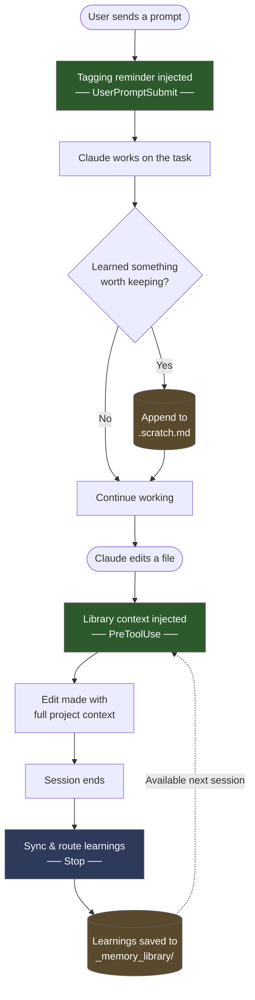

# Librarian

A hierarchical memory library plugin for Claude Code. Automatically loads project-specific context when editing files and captures learnings across sessions.

## How It Works



### `librarian-read.sh` — loads context before edits, reminds to tag learnings

**On every prompt (UserPromptSubmit):** Injects a compact tagging reminder into context so Claude captures learnings to `.scratch.md` during regular work.

**Before Edit/Write (PreToolUse):** Walks **up** the `_memory_library/` tree from the file being edited, collecting all `.md` files along the way. Injects them into Claude's conversation so it has full project context before making changes.

Example: editing `src/api/auth.py` loads:
1. `_memory_library/src/api/*.md` (most specific)
2. `_memory_library/src/*.md`
3. `_memory_library/*.md` (most general)

### `librarian-write.sh` — saves learnings after sessions

Fires automatically when a session ends. Does two things:

1. **Syncs auto-memory**: Scans `~/.claude/projects/.../memory/` for feedback Claude saved during the session and adds it to `.scratch.md` with appropriate tags
2. **Routes scratch entries**: Reads each `## [TAG: path, type: file]` block in `.scratch.md` and appends it to `_memory_library/<path>/<file>.md` (creates the file if it doesn't exist)

## Memory Library Structure

The library mirrors your repo's file tree:

```
_memory_library/
├── patterns.md                    # Repo-wide conventions
├── tech.md                        # Tech stack, commands, setup
├── product.md                     # Business context, domains
├── src/
│   └── api/
│       ├── patterns.md            # API-specific patterns
│       └── edge.md                # API edge cases
└── .scratch.md                    # Pending learnings (gitignored)
```

## Tagging Learnings

During work, Claude writes learnings to `.scratch.md` with routing metadata:

```markdown
## [TAG: src/api, type: edge]
- Auth tokens expire silently — always check response status

## [TAG: global, type: patterns]
- Use `dbt build` not just `compile` for validation
```

| Field | Controls | Examples |
|-------|----------|----------|
| `path` | Target directory | `global` (root), `src/api`, `models/launch/btbi` |
| `type` | Target filename | `patterns`, `tech`, `product`, `troubleshooting`, `edge` |

The stop hook routes `[TAG: src/api, type: edge]` → `_memory_library/src/api/edge.md`.

## Installation

```bash
/plugin install librarian
/reload-plugins
```

Hooks activate automatically. Run the setup skill to configure your library:

```bash
/librarian-setup                   # choose location, optionally import existing memory bank
```

## Skills

| Skill | Purpose |
|-------|---------|
| `/librarian read <path>` | Show all library context for a file path |
| `/librarian update` | Process pending scratch entries now |
| `/librarian status` | Show library stats |
| `/librarian-setup` | Configure library path, optionally import existing memory bank |
| `/librarian-help` | How it works, troubleshooting, tips for effective use |

## Debug Logging

Hooks log to `~/.claude/librarian.log`. Toggle at the top of each `.sh` script:

```bash
LIBRARIAN_LOG_ENABLED=true   # false to disable
```

```
[03:39:53] [read]  Triggered for: src/api/auth.py
[03:39:53] [read]  Injecting context: 4 files
[03:40:01] [write] Phase 1: Synced auto-memory 'Always run dbt build' (feedback -> patterns)
[03:40:01] [write] Phase 2: Routed 3 entries -> _memory_library/src/api/edge.md
```

## Plugin Structure

```
plugins/librarian/
├── .claude-plugin/plugin.json        # Manifest
├── hooks/hooks.json                  # Hook config (PreToolUse + Stop + UserPromptSubmit)
├── scripts/
│   ├── librarian-read.sh     # Context injection + prompt reminder
│   ├── librarian-write.sh    # Auto-memory sync + routing
│   └── setup.sh              # Standalone setup (without plugin)
├── skills/
│   ├── librarian/SKILL.md           # Core skill
│   └── librarian-setup/SKILL.md      # Setup + import skill
└── README.md
```

## Requirements

No external dependencies. Scripts use only native shell (`bash`/`grep`/`sed`/`awk`). Requires `bash` (available on macOS, Linux, and Windows via Git Bash).
